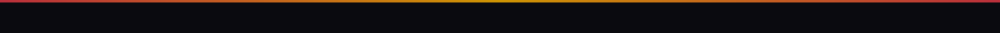

<!-- BANNER -->

<!-- NAME -->
# Hi, I'm Saichandra 👋

<!-- TYPING ANIMATION -->

<!-- CONTACT BADGES -->
 

&nbsp;

&nbsp;

---

## 🚗 Featured Project — PitStop

> **On-demand roadside mechanic. Like Swiggy for car breakdowns.**
> A user hits SOS → nearby mechanics are notified in real time → one accepts → both track the job on a live map. Three roles (User, Mechanic, Admin), full auth, AI job briefings, and Web Push that wakes a locked phone screen.

  

 

**What makes it non-trivial:**

- **Cascading broadcast rings** — SOS triggers `@Scheduled` escalation across 0→2, 2→5, 5→10, 10→20 km rings using Haversine distance. No mechanic gets missed; no spam storm on day one.
- **Race-free WebSocket push** — job update events are published inside `afterCommit()`, so a connected client can never receive a job ID before the row is readable in the DB.
- **Web Push that wakes a locked screen** — VAPID push sent with `Urgency: HIGH` + `requireInteraction: true`; a mechanic's phone lights up even when the app is closed.

**Stack:** `Spring Boot 3` · `Spring Security / JWT` · `PostgreSQL` · `React 18 + Vite` · `WebSocket / STOMP` · `Gemini 2.5 Flash` · `Web Push (VAPID)` · `Cloudinary` · `PWA`

&nbsp;

---

## 🛠 Tech Stack

 
Deployed on <strong>Render</strong> (backend) · <strong>Vercel</strong> (frontend) · <strong>Neon PostgreSQL</strong> (cloud DB)

---

## 📊 GitHub Stats

<table>
<tr>
<td>

</td>
<td>

</td>
</tr>
</table>

---

## 👤 About Me

- 🔨 I build full-stack systems end to end — Spring Boot REST APIs, React frontends, shipped to production
- 📚 Currently strengthening DSA foundations and studying system design patterns
- 🎯 Open to **backend** or **full-stack** roles

---

